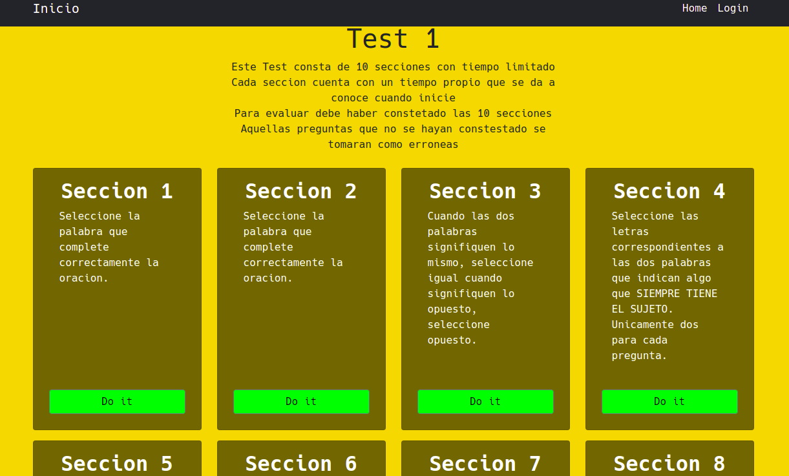

Mejorando proyectos pasados.  
Ahora con
- django-rest-framework para las apis de comuniacion.  
- bootstrap para el frontend.  


Proyectos incluidos actualmente:
- [Psicometrica](https://github.com/Ojitos369/psicometria) - (Construyendo...)  
  

## Capturas





Para probarlo:  
- Instalar las dependencias:  
    ```
    pip install -r requirements.txt
    ```
- Crea el archivo:  
    ```
    ojitos369/ojitos369/mysecret.py
    ```
    y agrega la variable SECRET_KEY 
    y la variable my_database con los datos de conexion a la base de datos.  

- Haz las migraciones:(Ya vienen incluidas)(Ejecutar en caso de usar otra base de datos)  
    ```
    python manage.py makemigrations psico_api
    python manage.py migrate
    ```

- Para agregar los datos a la db:(Ya vienen precargadas en sqlite3)(Ejecutar en caso de usar otra base de datos)  
    en `python manage.py shell`  
    ejecuta los scripts de `db_info/db_scripts.py`  

- Arreglar rest framework swagger:  
    en `./venv/lib64/python3.8/site-packages/rest_framework_swagger/templates/rest_framework_swagger/index.html`  
    en la linea 2 cambia  
    ``  
    por  
    ``  

**Direccion root '/' no esta agregada, ingresar a /psico**